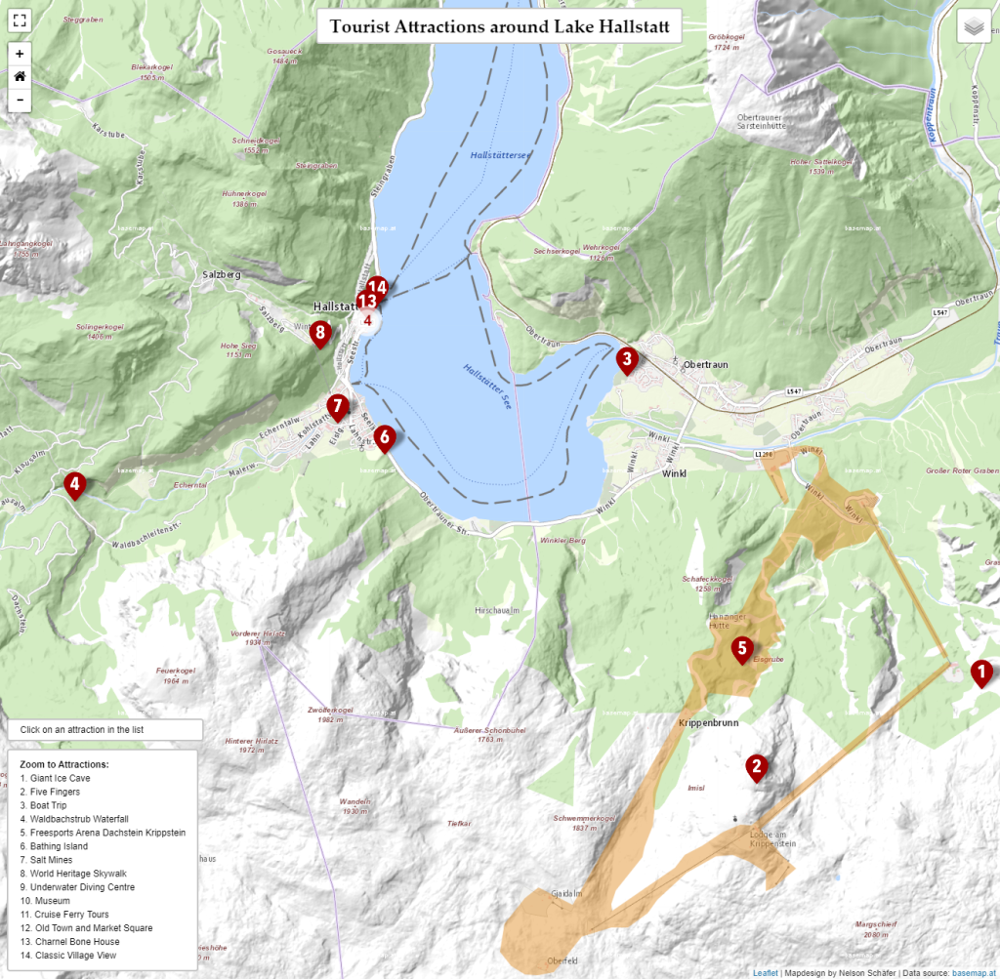

# Leaflet Web Map of tourist attractions in Hallstatt

The goal was to translate the information of a static map into an interactive web map application.

For creating the web map the JavaScript library Leaflet was used. The map features 14 selected tourist attractions around Lake Hallstatt as well as other vector data for ferry routes and a ski resort. Additionally, the user can switch between three basemaps. Leaflet plugins for point clustering and a fullscreen option add more value to the map.

[See the application in action here](https://nelsonschaefer.github.io/LeafletWebMapHallstatt/)!

